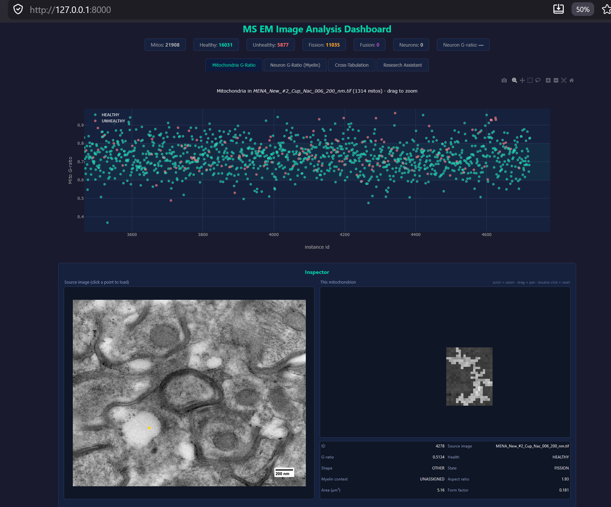

# Mitochondria Health Classifier

End-to-end pipeline for finding mitochondria in electron-microscopy (EM)
images and scoring each one as **healthy** or **unhealthy**.

Built around:

- A **U-Net** segmenter that locates individual mitochondria in a full image.
- A **ResNet-50** classifier that scores each detected mitochondrion.
- A **Claude vision** labelling loop (3-pass self-consensus) that builds the
  training set without large-scale manual annotation.
- A **FastAPI dashboard** for browsing per-image results, crops, and metrics.

---

## What's in the box

```
mito_classifier/
├── src/                     # All pipeline code (segmentation, training, inference, labelling)
├── app/                     # FastAPI dashboard (routes, templates, static assets)
├── scripts/                 # CLI wrappers and helper jobs (.bat + .py)
├── tests/                   # Smoke tests (module imports, pricing table sanity)
├── configs/                 # YAML configs
├── notebooks/               # Exploratory notebooks (optional)
├── data/                    # Inputs (gitignored — supply your own)
├── outputs/                 # Models, predictions, crops (gitignored)
├── requirements.txt
├── environment.yml
└── README.md
```

Data folders and `outputs/` are intentionally **not** tracked — every
artefact in them is reproducible from the scripts here.

---

## Quick start

> **Brand new to Python / git?** See [Before you start](#before-you-start)
> below — it walks you through the one-time install.

### 1. Get the code

```powershell
git clone https://github.com/chandrafullstack/mt-image-analysis.git
cd mt-image-analysis
```

### 2. Environment

```powershell
python -m venv .venv
.\.venv\Scripts\Activate.ps1
pip install -r requirements.txt
```

(Or use `conda env create -f environment.yml`.)

### 3. Download the trained models

```powershell
powershell -ExecutionPolicy Bypass -File scripts\download_models.ps1
```

This pulls the ResNet-50 classifier into `outputs/models/`. If you also
want the U-Net segmenter, train one with `scripts\train_unet.bat` — the
pipeline falls back to a classical Otsu-threshold segmenter if no U-Net
weights are present, so you can run the dashboard either way.

### 4. Set your Claude API key (only needed for the chat assistant + relabelling)

Copy `.env.example` to `.env` and paste your key:

```
ANTHROPIC_API_KEY=sk-ant-...
```

Or export it directly:

```powershell
$env:ANTHROPIC_API_KEY = "sk-ant-..."
```

The trained models run with **no external calls** — the key is only used
when you (a) ask the dashboard chat assistant a question, or (b) run a
fresh round of Claude pseudo-labelling for training.

### 5. Run inference on your own images

Drop EM images (PNG / JPG / TIFF) into a folder, then:

```powershell
python -m src.full_image_inference `
  --input-dir "C:\path\to\images" `
  --metrics-out outputs/metrics/my_metrics.csv `
  --crops-out outputs/crops/my_crops `
  --seg-method unet `
  --unet-weights outputs/models/unet_best.pt `
  --classifier-weights outputs/models/resnet50_best.pt
```

No U-Net weights? Use the heuristic segmenter:

```powershell
python -m src.full_image_inference `
  --input-dir "C:\path\to\images" `
  --metrics-out outputs/metrics/my_metrics.csv `
  --crops-out outputs/crops/my_crops `
  --seg-method heuristic `
  --classifier-weights outputs/models/resnet50_best.pt
```

Pixel-size override (if your images aren't EM):

```powershell
... --pixel-size-um 0.02
```

### 6. Launch the dashboard

```powershell
scripts\start_dashboard.bat
# then open http://localhost:8000
```



---

## Before you start

**Skip this if you already have Python 3.10+ and git installed.**

You'll need three things on Windows:

1. **Python 3.10 or newer**
   Install from <https://www.python.org/downloads/windows/> — **tick
   "Add Python to PATH"** on the first screen of the installer.
   Verify: open PowerShell and run `python --version`.

2. **Git**
   Install from <https://git-scm.com/download/win> — defaults are fine.
   Verify: `git --version`.

3. **About 2 GB of free disk space** for the Python virtual environment
   and the trained model weights.

Optional but recommended:

- **VS Code** (<https://code.visualstudio.com>) — nicer than Notepad
  for poking at config files.
- An **Anthropic API key** (<https://console.anthropic.com>) if you want
  to use the chat assistant or run new labelling rounds. The pre-trained
  models do **not** need an API key to run.

Once those are installed, jump back up to [Quick start](#quick-start).

---

## Training pipeline

The classifier is trained on Claude-generated pseudo-labels. The loop:

1. Extract crops from a labelled segmentation pass.
2. Send a sample to Claude with a 3-pass self-consensus protocol
   ([src/claude_score_crops.py](src/claude_score_crops.py)).
3. Keep only labels with ≥0.67 vote agreement and ≥0.55 calibrated
   confidence.
4. Train ResNet-50 with a **group-aware** train/val/test split
   (different source images in each split) so the test metric is
   honest ([src/train_pseudo_labels.py](src/train_pseudo_labels.py)).
5. Sweep classification thresholds against val
   ([scripts/threshold_sweep.py](scripts/threshold_sweep.py)).
6. Retrain on hard negatives from the deployed model
   ([scripts/round2_hardneg_select.py](scripts/round2_hardneg_select.py)).

Example training command:

```powershell
python -m src.train_pseudo_labels `
  --consensus-csv outputs/predictions/round0_200nm_consensus.csv `
  --consensus-csv outputs/predictions/round1_consensus.csv `
  --metrics-csv outputs/metrics/round0_200nm.csv `
  --crops-dir outputs/crops/round0_200nm `
  --output-dir outputs/models_v2 `
  --epochs 25 --batch-size 16
```

`--consensus-csv` is repeatable — passing multiple CSVs auto-merges
and de-duplicates by `crop_file`.

---

## Cost control

The Claude scorer enforces a **hard USD cap** on every run via
`--budget-usd`. It refuses to make a call that would push the running
total past the cap. Pricing for supported models is hard-coded in
[src/claude_score_crops.py](src/claude_score_crops.py); a missing
model causes an immediate abort rather than surprise spend.

---

## Tests

```powershell
python -m pytest tests/ -v
# or:
python tests/test_imports.py
python scripts/import_check.py
```

CI runs the same tests on every push — see
[.github/workflows/ci.yml](.github/workflows/ci.yml).

---

## Data sources

Public datasets the included scripts can pull / consume:

- **EPFL Rat Hippocampus** (electron microscopy of CA1 region)
- **MitoEM** (rat + human cortex, instance-segmented mitochondria)

See [src/data_download.py](src/data_download.py).

---

## Notes for researchers

- Drop your own labelled images into `incoming/healthy/` and
  `incoming/unhealthy/`; the dashboard auto-ingests them.
- Outputs are written under `outputs/`; nothing is sent to any
  external service except the Claude labelling step (which only fires
  when you explicitly run [src/claude_score_crops.py](src/claude_score_crops.py)).
- See [RESEARCHER_STEP_BY_STEP.md](RESEARCHER_STEP_BY_STEP.md) (kept
  locally, not tracked) for the long-form walk-through.

---

## License

MIT — see [LICENSE](LICENSE).
